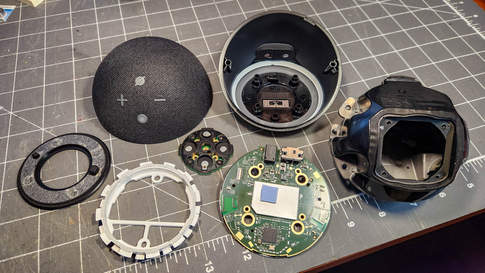
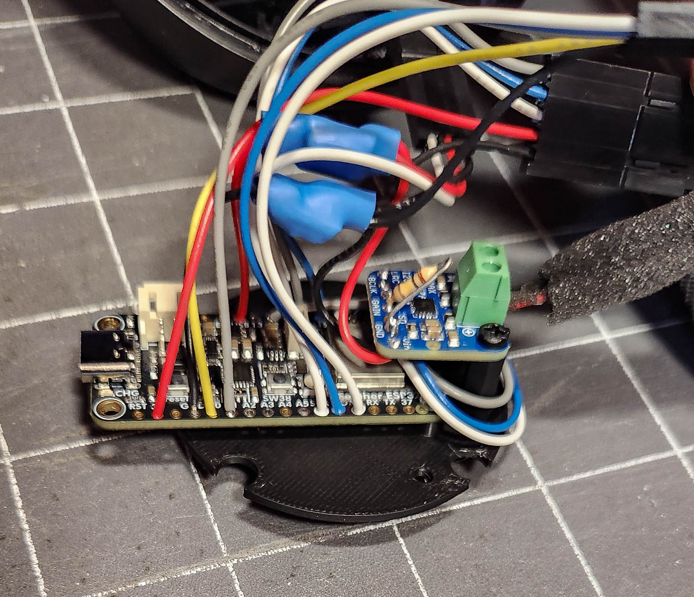

# Echo Jarvis
Converting an Amazon Echo Dot housing to contain an ESPHome implementation of Home Assistant voice assist using an ESP32 processor and other electronics devices from Adafruit.
Named after the "Hey Jarvis" wakeword. This is **NOT** a reverse engineering hack of the Echo circuit boards or software, just a repurposing of the sphere housing to contain
several Adafruit electronics parts brought together to make an IoT device for home automation and control. Many others have accomplished the same functionality, housed in
a utilitarian if not aesthetically pleasing 3D-printed box. I wanted something a bit more novel and fun!

## The disassembled Echo Dot:

## Replacement guts:

## The Gallery:
More images and build details are in my [project gallery](https://scottferguson.smugmug.com/Projects/Echo-Jarvis).

## Files:
This project includes the following files:
* Fusion 360 (F3D) files and 3D-printable OBJ files for the button plate and processor mount base plate.
* A spreadsheet with wiring details and parts list with links.
* An image of the wiring details for the processor.
* The YAML file for creating the ESPHome device. This is very basic, but provides a sweet little mechanism for
volume control borrowed from another ESPHome user. (Credits in the file.)
